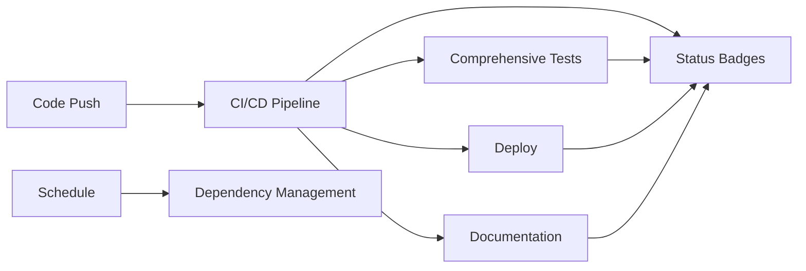

# GitHub Actions Workflows

This repository includes a comprehensive set of GitHub Actions workflows to ensure code quality, testing, deployment, and documentation management.

## Workflows Overview

### 1. CI/CD Pipeline (`ci.yaml`)

The main continuous integration and deployment pipeline that runs on every push and pull request.

**Jobs:**
- **Code Quality**: Type checking, formatting validation, and linting
- **Unit Tests**: Runs tests across multiple Node.js versions
- **Build Verification**: Builds the application and uploads artifacts
- **Integration Tests**: Verifies application structure and functionality
- **Security Checks**: Dependency auditing and vulnerability scanning
- **Deployment Ready**: Final validation for deployment readiness

**Triggers:**
- Push to `master`/`main` branch
- Pull requests
- Manual dispatch

### 2. Comprehensive Testing (`comprehensive-tests.yaml`)

Extended testing suite that runs comprehensive tests across multiple platforms and scenarios.

**Jobs:**
- **Cross-Platform Tests**: Tests across Ubuntu, Windows, and macOS with multiple Node.js versions
- **Performance Tests**: Bundle size analysis and startup performance testing
- **Integration Tests**: External service connectivity and API endpoint testing
- **E2E Tests**: End-to-end testing with Playwright (placeholder for future implementation)

**Triggers:**
- Daily schedule (2 AM UTC)
- Manual dispatch with test suite selection

### 3. Deployment (`deploy.yaml`)

Automated deployment pipeline for staging and production environments.

**Jobs:**
- **Pre-deployment Checks**: Environment determination and validation
- **Build for Deployment**: Production-optimized builds with artifact management
- **Deploy to Staging**: Staging environment deployment (on master/main pushes)
- **Deploy to Production**: Production deployment (on version tags)
- **Post-deployment Monitoring**: Health checks and alert setup

**Triggers:**
- Push to `master`/`main` branch (staging)
- Version tags (production)
- Manual dispatch with environment selection

### 4. Documentation (`documentation.yaml`)

Automated documentation generation and deployment.

**Jobs:**
- **API Documentation**: TypeScript API docs with TypeDoc
- **Documentation Quality**: README validation and link checking
- **Changelog Generation**: Automated changelog updates
- **Deploy to GitHub Pages**: Documentation site deployment

**Triggers:**
- Push to `master`/`main` with documentation changes
- Pull requests affecting documentation
- Manual dispatch

### 5. Dependency Management (`dependency-management.yaml`)

Automated dependency monitoring and updates.

**Jobs:**
- **Security Audit**: Vulnerability scanning with detailed reports
- **Dependency Check**: Outdated package detection
- **Dependency Update**: Automated updates with pull request creation
- **License Compliance**: License compatibility checking

**Triggers:**
- Weekly schedule (Mondays at 9 AM UTC)
- Manual dispatch with update type selection

### 6. Status Badges (`status-badges.yaml`)

Maintains status badges in the README for workflow visibility.

**Jobs:**
- **Update Badges**: README badge URL updates and synchronization

**Triggers:**
- Completion of other workflows
- Manual dispatch

## Environment Variables

All workflows use consistent environment variables:

```yaml
env:
  NODE_VERSION: '20.15.1'
  PNPM_VERSION: '9.4.0'
```

## Workflow Features

### ✅ **Comprehensive Coverage**
- Code quality checks (TypeScript, ESLint, Prettier)
- Multi-platform testing (Ubuntu, Windows, macOS)
- Security scanning and dependency auditing
- Automated documentation generation
- Deployment automation

### ⚡ **Performance Optimized**
- Parallel job execution
- Intelligent caching strategies
- Timeout configurations
- Artifact management
- Matrix builds for efficiency

### 🔧 **Developer Experience**
- Clear error reporting
- Workflow summaries
- Manual dispatch options
- Configurable test suites
- Status badge integration

### 🛡️ **Security Focused**
- Dependency vulnerability scanning
- License compliance checking
- Secure artifact handling
- Environment isolation
- Audit trail maintenance

## Manual Workflow Execution

All workflows support manual execution via `workflow_dispatch` with relevant input parameters:

1. **Comprehensive Tests**: Choose specific test suites
2. **Deploy**: Select target environment
3. **Dependency Management**: Choose update scope
4. **Documentation**: Force regeneration

## Workflow Dependencies



## Monitoring and Alerts

- **Build Status**: Visible via status badges
- **Security Alerts**: Automated dependency scanning
- **Performance Monitoring**: Bundle size tracking
- **Documentation Updates**: Automated changelog generation

## Contributing

When adding new workflows:

1. Follow the existing naming convention
2. Include proper timeout configurations
3. Add comprehensive error handling
4. Update this documentation
5. Test manually before merging

## Troubleshooting

### Common Issues

1. **Build Timeouts**: Increase `timeout-minutes` in job configuration
2. **Dependency Conflicts**: Check `pnpm-lock.yaml` for resolution issues
3. **Platform Differences**: Review matrix build logs for OS-specific issues
4. **Deployment Failures**: Verify environment variables and permissions

### Debugging Workflows

- Enable debug logging with `ACTIONS_STEP_DEBUG=true`
- Review workflow run logs in GitHub Actions tab
- Check artifact uploads for build outputs
- Validate YAML syntax before pushing

For more detailed information about specific workflows, see the individual workflow files in `.github/workflows/`.